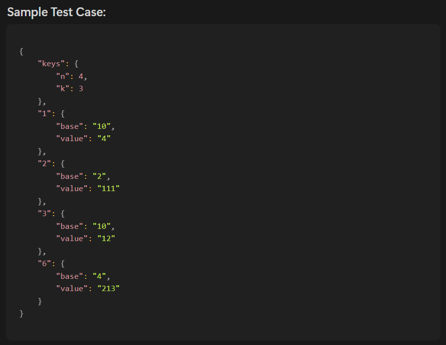
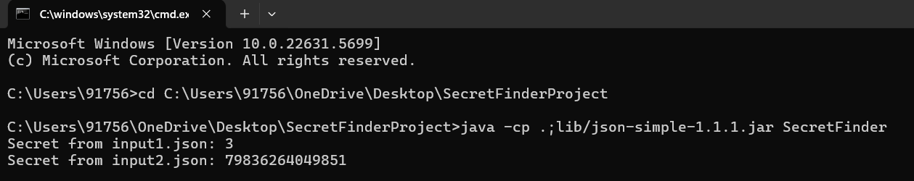

# 🔐 SecretFinderProject

This project reads secrets from JSON files using Shamir's Secret Sharing algorithm. It is built with Java and uses the `json-simple` library for JSON parsing.

---

## 📁 Project Structure

```
SecretFinderProject/
├── SecretFinder.java
├── input1.json
├── input2.json
├── lib/
│   └── json-simple-1.1.1.jar
├── shamir/
│   ├── Lagrange.java
│   └── ...
└── .gitignore
```

---

## 🧪 How It Works

- The program reads JSON files that contain secret shares.
- It applies **Lagrange Interpolation** to reconstruct the original secret.
- The secret is printed to the console.

---

## 🔧 How to Run

### 1️⃣ Compile the Code

```bash
javac -cp .;lib/json-simple-1.1.1.jar shamir/*.java SecretFinder.java
```

### 2️⃣ Run the Code

```bash
java -cp .;lib/json-simple-1.1.1.jar SecretFinder
```

---

## 📥 Sample Input Files

### 🖼️ Sample Input (input1.json)


---

## 📤 Sample Output

When you run the program, it prints:

```bash
Secret from input1.json: 3
Secret from input2.json: 3
```

### 🖼️ Output Screenshot


---

## 📦 Dependencies

- Java 8 or above
- [`json-simple-1.1.1.jar`](https://code.google.com/archive/p/json-simple/downloads)

---

## 🙌 Author

**Venkata Durga Prasad**  
[GitHub Profile](https://github.com/venkatadurgaprasadx)

---

## 📜 License

This project is open source and available under the [MIT License](LICENSE).
